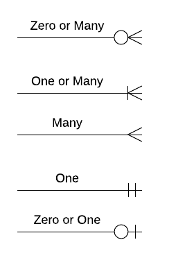
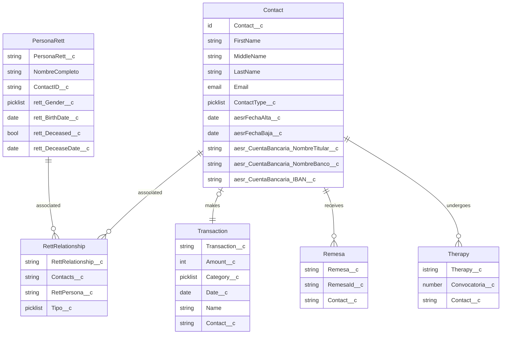

```mermaid
erDiagram

    Contact ||--o{ RettRelationship : associated
    PersonaRett ||--o{ RettRelationship : associated

    Contact |o--|| Transaction : makes
    Contact ||--o{ Remesa : receives
    Contact ||--o{ Therapy : undergoes

    Contact {
        id Contact__c
        string FirstName
        string MiddleName
        string LastName
        email Email
        picklist ContactType__c
        date aesrFechaAlta__c
        date aesrFechaBaja__c
        string aesr_CuentaBancaria_NombreTitular__c
        string aesr_CuentaBancaria_NombreBanco__c
        string aesr_CuentaBancaria_IBAN__c
    }

    PersonaRett {
        string PersonaRett__c
        string NombreCompleto
        string ContactID__c
        picklist rett_Gender__c
        date rett_BirthDate__c
        bool rett_Deceased__c
        date rett_DeceaseDate__c
    }

    RettRelationship {
        string RettRelationship__c
        string Contacts__c
        string RettPersona__c
        picklist Tipo__c
    }

    Transaction {
        string Transaction__c
        int Amount__c
        picklist Category__c
        date Date__c
        string Name
        string Contact__c
    }

    Therapy {
        istring Therapy__c
        number Convocatoria__c
        string Contact__c
    }

    Remesa {
        string Remesa__c
        string RemesaId__c
        string Contact__c
    }

```