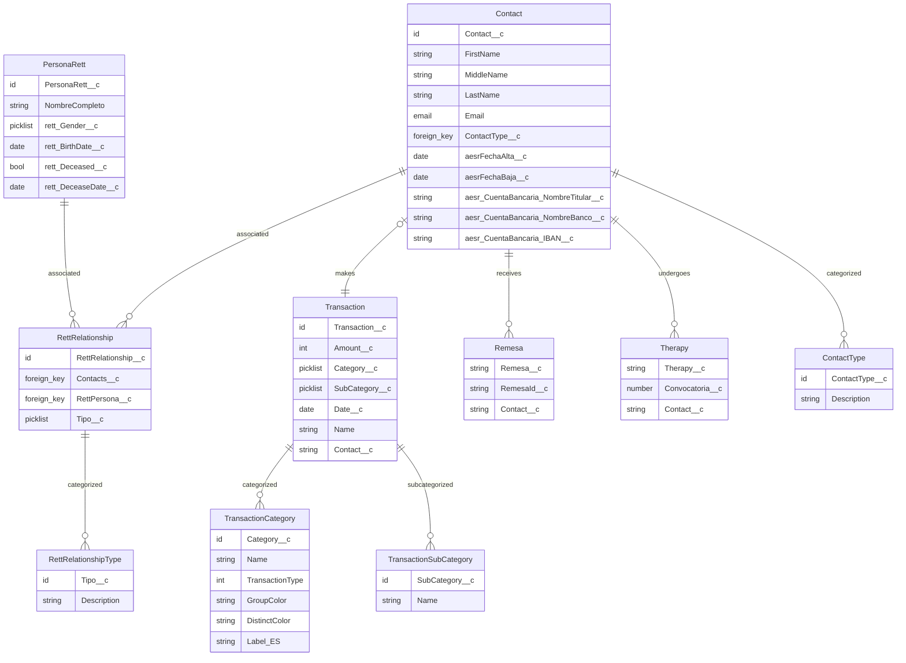

```mermaid
erDiagram

    Contact ||--o{ RettRelationship : associated
    PersonaRett ||--o{ RettRelationship : associated

    Contact |o--|| Transaction : makes
    Contact ||--o{ Remesa : receives
    Contact ||--o{ Therapy : undergoes

    Contact ||--o{ ContactType : categorized
    RettRelationship ||--o{ RettRelationshipType : categorized
    Transaction ||--o{ TransactionCategory : categorized
    Transaction ||--o{ TransactionSubCategory : subcategorized

    Contact {
        id Contact__c
        string FirstName
        string MiddleName
        string LastName
        email Email
        foreign_key ContactType__c
        date aesrFechaAlta__c
        date aesrFechaBaja__c
        string aesr_CuentaBancaria_NombreTitular__c
        string aesr_CuentaBancaria_NombreBanco__c
        string aesr_CuentaBancaria_IBAN__c
    }

    PersonaRett {
        id PersonaRett__c
        string NombreCompleto
        picklist rett_Gender__c
        date rett_BirthDate__c
        bool rett_Deceased__c
        date rett_DeceaseDate__c
    }

    RettRelationship {
        id RettRelationship__c
        foreign_key Contacts__c
        foreign_key RettPersona__c
        picklist Tipo__c
    }

    Transaction {
        id Transaction__c
        int Amount__c
        picklist Category__c
        picklist SubCategory__c
        date Date__c
        string Name
        string Contact__c
    }

    Therapy {
        string Therapy__c
        number Convocatoria__c
        string Contact__c
    }

    Remesa {
        string Remesa__c
        string RemesaId__c
        string Contact__c
    }

    ContactType {
        id ContactType__c
        string Description
    }

    RettRelationshipType {
        id Tipo__c
        string Description
    }

    TransactionCategory {
        id Category__c
        string Name
        int TransactionType
        string GroupColor
        string DistinctColor
        string Label_ES
    }

    TransactionSubCategory {
        id SubCategory__c
        string Name
    }


```