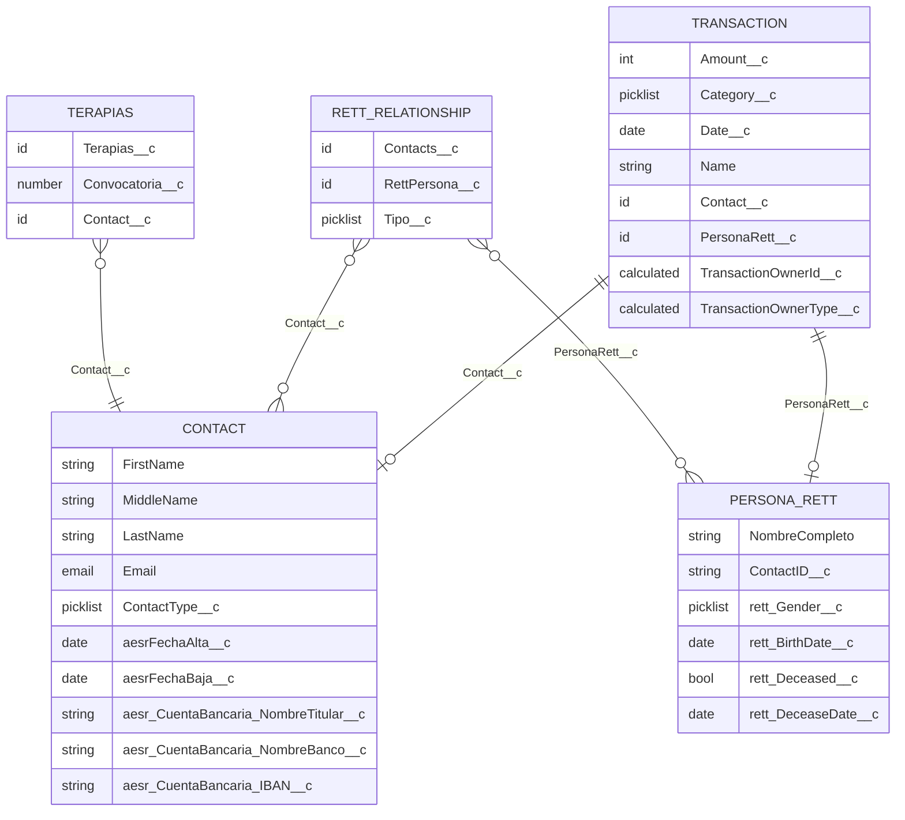

```mermaid
erDiagram
    TRANSACTION ||--o| CONTACT : Contact__c
    TRANSACTION ||--o| PERSONA_RETT : PersonaRett__c
    RETT_RELATIONSHIP }o--o{ CONTACT : Contact__c
    RETT_RELATIONSHIP }o--o{ PERSONA_RETT : PersonaRett__c
    TERAPIAS }o--|| CONTACT : Contact__c

    TRANSACTION {
        int Amount__c
        picklist Category__c
        date Date__c
        string Name
        id Contact__c
        id PersonaRett__c
        calculated TransactionOwnerId__c
        calculated TransactionOwnerType__c
    }

    CONTACT {
        string FirstName
        string MiddleName
        string LastName
        email Email
        picklist ContactType__c
        date aesrFechaAlta__c
        date aesrFechaBaja__c
        string aesr_CuentaBancaria_NombreTitular__c
        string aesr_CuentaBancaria_NombreBanco__c
        string aesr_CuentaBancaria_IBAN__c
    }

    PERSONA_RETT {
        string NombreCompleto
        string ContactID__c
        picklist rett_Gender__c
        date rett_BirthDate__c
        bool rett_Deceased__c
        date rett_DeceaseDate__c
    }

    RETT_RELATIONSHIP {
        id Contacts__c
        id RettPersona__c
        picklist Tipo__c
    }

    TERAPIAS {
        id Terapias__c
        number Convocatoria__c
        id Contact__c
    }
```